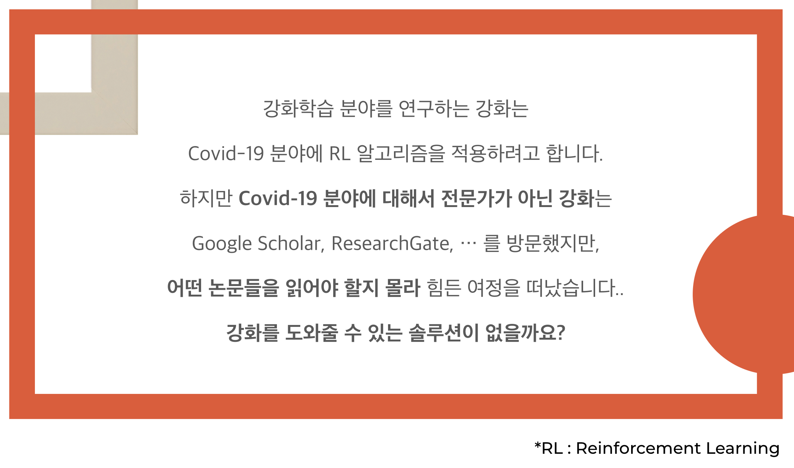

# PaperFlow

**[http://paperflow.org](http://paperflow.org)** (현재는 서버를 운영중이지 않습니다)

- Archived Pages
  - [Landing Page](https://web.archive.org/web/20210801085134mp_/http://paperflow.org/)
  - [Search Page](https://web.archive.org/web/20210801085351/http://paperflow.org/search)
  - [Detail Page](https://web.archive.org/web/20210801090057/http://paperflow.org/paper-detail?id=3d49b0ee9250a42759b7d9566478b9fb7129741e)
  - [Keyword Graph Page](https://web.archive.org/web/20210801085631/http://paperflow.org/keyword-network)
  - [Statistics Page](https://web.archive.org/web/20210801085704/http://paperflow.org/statistics)
  - [Newsletter Page](https://web.archive.org/web/20210801085745/http://paperflow.org/email-input)

**팀페이지 주소**: https://kookmin-sw.github.io/capstone-2021-8

- [PaperFlow](#PaperFlow)
  - [1. 프로젝트 소개](#1-프로젝트-소개)
    - [1.1. 핵심 서비스](#11-핵심-서비스)
  - [2. Abstract](#2-Abstract)
  - [3. 소개 영상](#3-소개-영상)
  - [4. 팀 소개](#4-팀-소개)
  - [5. 사용법](#5-사용법)
    - [5.1. client/paperflow-web-v1](#51-client/paperflow-web-v1)
    - [5.2. server/paperflow-functions-v1](#52-server/paperflow-functions-v1)
  - [6. 기타](#6-기타)

## 1. 프로젝트 소개


PaperFlow는 각 논문의 참조 (references)를 자동 추출 및 가중치 분석 (각 참조된 논문이 현재 논문에서 얼만큼 중요도를 가지는지)을 통해 사용자가 어떤 논문이 현재 어떤 식으로 연구되고 있는지 **“연구 동향을 쉽고 빠르게 파악할 수 있도록 도와주는 웹 서비스”** 입니다.

### 1.1. 핵심 서비스

- 논문 기본 정보 열람
- 논문 흐름 서비스
- 연구 키워드 시각화
- 연구 통계
- 뉴스레터

### 1.2. 발표 자료

- [최종 발표 자료](https://github.com/kookmin-sw/capstone-2021-8/blob/master/docs/%EC%B5%9C%EC%A2%85%20%EB%B0%9C%ED%91%9C_team8.pdf)

### 1.3. 포스터

- [최종 포스터](https://github.com/kookmin-sw/capstone-2021-8/blob/master/docs/%ED%8F%AC%EC%8A%A4%ED%84%B0.pdf)

## 2. Abstract

The PaperFlow is a service that helps researchers to catch up current research flow by automatically extracting references from papers and estimating the similarity between those papers.

## 3. 소개 영상

### 3.1. 시연 영상

[](http://www.youtube.com/watch?v=wibfS6SR_P0)

## 4. 팀 소개

- 윤상건

  - Role: 팀장, Full-stack, AWS 배포, 데이터 분석
  - Student ID: 20191632
  - E-Mail: ggj06281@kookmin.ac.kr
  - Github: [@c0510gy](https://github.com/c0510gy)

- 이민종

  - Role: Full-stack, 데이터 시각화, 데이터 분석
  - Student ID: 20181656
  - E-Mail: lsjppp8069@kookmin.ac.kr
  - Github: [@hughugh](https://github.com/hughugh)

- 김태영

  - Role: Back-end, DB 구축, 데이터 분석
  - Student ID: 20160729
  - E-Mail: tykim75@kookmin.ac.kr
  - Github: [@tykim75](https://github.com/tykim75)

## 5. 사용법

### 5.1. client/paperflow-web-v1

```
cd ./client/paperflow-web-v1
npm install
npm run dev
```

### 5.2. server/paperflow-functions-v1

```
cd ./server/paperflow-functions-v1
python3 -m venv ./venv
source ./venv/bin/activate
pip3 install -r requirements.txt
python3 ./paperflowServer/manage.py migrate
python3 ./paperflowServer/manage.py runserver
```

## 6. 기타
